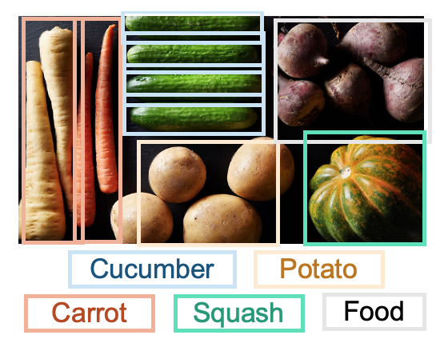

# README

This folder contains input data for triggering anti-patterns.

The following content are tested on Google Cloud AI.

## How to call the APIs

Please follow the instructions in `../Tools/API_wrappers/readme.md` to set up the enviornment.

You may use either the functions in `calling_apis.py` or `../Tools/API_wrappers` to test the APIs.

## 1. Text-detection and document-text-detection (Section IV.A)

**Case1**: Should use text-detection API on `text/text_detection.jpg`

Ground truth: EGG M AL ASSET MA BF

text-detection result: EGG M  AL ASSET MA  BEF

document-text-detection result: EGG M  IL  ASSET MA  BST

**Case2**: Should use document-text-detection API on `text/document_text_detection.jpg`

Ground truth: Though they may gather some Left-wing support, a large majority of Labour 0M Ps are likely to turn down the Foot-Griffiths resolution. Mr. Foot’s Line will be that as Labour 0M Ps opposed the Government Bill which brought life peers into existence, they should not now put forward momimees. He believes that the House of Lards should be abolished and that Labour should not take any steps which would appear to "prop up" an out-dated institution.

text-detection result:  Thayh Hhey may  gather some laft  wing suppet,, a  large sngjesily of  kebour OM  B  are Labour OM  R Libely to fum  down the Foot- Grifiths resolukon.  Mr. Foot's Line  sill be that as Labour OM  B Oppotedl  the Gouean meut 3:ll which  baylat Lie pers into  enisteuce, Hey the Should  mot mow put  fosaard mominces. Ite belrves thant the  Nouse ol kords  should be abolished aud  that habour  should not kalu auy steps  (sh) would  prop up au  But-daked inskikuhiem  

document-text-detection result: Though they may gather some Left wing support, large majority of Labour OMPs are likely to tuin dowom the Foot Griffiths resolution. Mi. Foot’s Line will be feat as Labour OMPs opposeel the Government Bill which brought life peers should not now put forward momimees. He belrves that the House of Cards should be a bolished and Hat Labou should not face auy steps Wh’I would "prop up” au out-date dinstitution.

**Other cases**

| File                | Preferred API           | Description                            |
| ------------------- | ----------------------- | -------------------------------------- |
| `text/survey.jpg`   | document-text-detection | A survey with handwritten fillings     |
| `text/receipt.jpeg` | document-text-detection | An image with two receipts             |
| `text/envelope.png` | document-text-detection | An envelope with handwritten addresses |
| `text/logo.jpg`     | text-detection          | A logo with text                       |

## 2. Image-classification and object-detection (Section IV.A)

**Case1**: Should use object-detection API on `label_object/object_detection.jpg`

image-classification result: Natural foods; Local food; Food; Vegetable; Vegan nutrition; Superfood; Root vegetable

object-detection result: 

**Other cases**

| File                        | Preferred API                       | Description                        |
| --------------------------- | ----------------------------------- | ---------------------------------- |
| `label_object/cat_dog.jpeg` | object-detection                    | An image contains both cat and dog |
| `label_object/logo.jpg`     | object-detection, or logo_detection | An image contains cinemark logo    |
| `label_object/snow.jpg`     | image-classification                | A snowing image                    |

## 3. Sentiment detection  (Section IV.B)

It should use both `score` and `magnitude`  fields to judge the sentiment of the input text: when the absolute value of either of them is small (e.g., `score` < 0.15), the sentiment should be considered neutral; otherwise, the sentiment is positive when score is positive and negative when score is negative.

| Input text                                                   | Ground truth  | Score (-1,1) | Magnitude (0, +∞) |
| ------------------------------------------------------------ | ------------- | ------------ | ----------------- |
| I am neither happy nor sad. There is nothing special today.  | Neural        | -0.30        | 0.60              |
| I am so happy and joyful. The whole world is singing to me.  | Positive      | 0.69         | 1.39              |
| Today is so horrible. I just cannot endure it.               | Negative      | -0.80        | 1.6               |
| I am happy and joyful in the morning. But a lot of bad things happens later and make me sad. | Mixed feeling | 0.0          | 1.79              |

## 4. Performance related anti-patterns  (Section V)

They could be easily triggered by extremely large inputs, e.g. 5-minute audio, 10MB images, 5000-character text.

